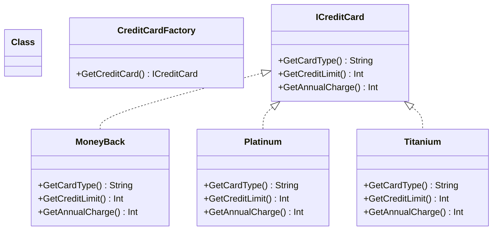

```mermaid
classDiagram

class Class

class CreditCardFactory
CreditCardFactory : +GetCreditCard() ICreditCard

class ICreditCard
ICreditCard : +GetCardType() String
ICreditCard : +GetCreditLimit() Int
ICreditCard : +GetAnnualCharge() Int

class MoneyBack
MoneyBack : +GetCardType() String
MoneyBack : +GetCreditLimit() Int
MoneyBack : +GetAnnualCharge() Int

class Platinum
Platinum : +GetCardType() String
Platinum : +GetCreditLimit() Int
Platinum : +GetAnnualCharge() Int

class Titanium
Titanium : +GetCardType() String
Titanium : +GetCreditLimit() Int
Titanium : +GetAnnualCharge() Int


ICreditCard <|.. MoneyBack
ICreditCard <|.. Platinum
ICreditCard <|.. Titanium

```
